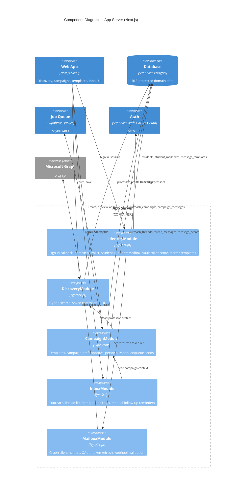
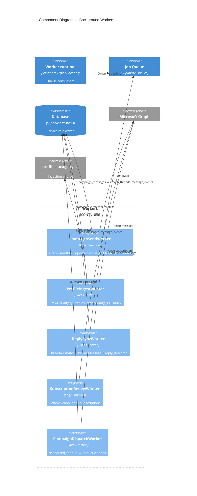

# C4 Component Diagram — App Server & Workers

Lightweight blueprint for module boundaries inside the **App Server** and **Background Workers** containers. Zoom level below [`c4-container.md`](./c4-container.md). Update when code layout diverges.

## App Server (Next.js server)

Route handlers and server actions stay thin; domain logic lives in modules.



## Background Workers (Supabase Edge Functions)

Workers import shared logic from the same modules where possible; queue consumers stay thin.



## Proposed repo layout

Blueprint only — create folders as each slice ships.

```text
src/
  app/                          # Next.js routes (thin)
    (auth)/
    api/webhooks/graph/         # Reply sync webhook → MailboxModule
    api/tracking/[token]/       # Open pixel (slice 5)
  modules/
    identity/                   # Slice 1
    discovery/                  # Slice 2
    campaigns/                  # Slice 3
    mailbox/                    # Slice 1 (token refresh); slice 3–4 (send/sync)
    inbox/                      # Slice 4
  workers/                      # Supabase Edge Function entrypoints
    campaign-send/
    profile-ingest/
    reply-sync/
    subscription-renew/
    campaign-dispatch/
supabase/
  migrations/                   # Just-in-time per slice
  functions/                    # Deploy targets → workers/
```

## Module rules

| Module | Aggregate roots | May call | Must not |
| --- | --- | --- | --- |
| **IdentityModule** | `students`, `student_mailboxes` | MailboxModule (token ops), Auth | Campaigns, Discovery queries |
| **DiscoveryModule** | `saved_professors` (student side); reads `professor_profiles` | — | Graph, queue |
| **CampaignModule** | `outreach_campaigns`, `campaign_messages`, `message_templates` | DiscoveryModule (read), queue | Direct Graph send (workers only) |
| **InboxModule** | `outreach_threads`, `thread_messages`, `follow_up_reminders` | CampaignModule (read context) | Graph |
| **MailboxModule** | — (integration) | Graph, Vault | Domain campaign/thread mutations |

**Workers** call into `mailbox/`, `campaigns/`, `discovery/` shared services — not duplicate Graph or SQL logic in function files.

## Slice mapping

| Slice | Modules / workers touched |
| --- | --- |
| 1 Auth + mailbox | `identity/`, `mailbox/`, `app/(auth)/` |
| 2 Discovery | `discovery/`, `workers/profile-ingest/` |
| 3 Campaign send | `campaigns/`, `workers/campaign-send/`, `workers/campaign-dispatch/` |
| 4 Inbox + reply sync | `inbox/`, `mailbox/`, `workers/reply-sync/`, `workers/subscription-renew/`, `app/api/webhooks/graph/` |
| 5 Open pixel | `app/api/tracking/`, `campaigns/` (event insert) |

## HTTP routes outside App Server modules

| Route | Container | Notes |
| --- | --- | --- |
| Open tracking pixel | Vercel route or Edge Function | Service role insert to `message_events`; no session |
| Graph webhook | App Server route | Validates handshake, enqueues `reply-sync` job |

## Out of scope at this level

- Code-level class diagrams
- Phase 2 agentic / iMessage interface (same modules later)
- Per-page React component breakdown (see Stitch designs)
