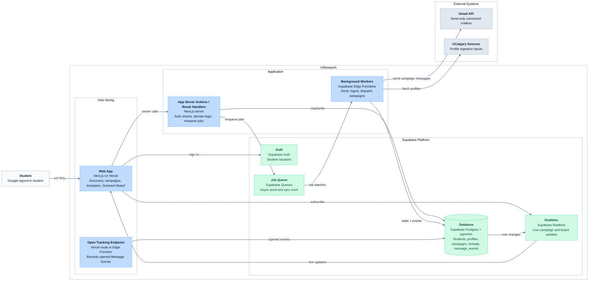

# C4 Container Diagram — UResearch

> Scope update, 2026-09-05: [ADR-0007](../../adr/0007-support-gmail-outreach-conversations.md) supersedes send-only, deferred reply-sync, and manual-reply-only statements in this earlier blueprint. Full Gmail outreach conversations are now planned for launch. This blueprint has not yet been revised for the sync implementation; use ADR-0007 and the new Gmail-conversations PRD for that work.

Major building blocks inside UResearch and how they communicate.

## Module to container mapping

| Module (from system design) | Primary container |
| --- | --- |
| Identity | Web + Auth + App server + `students` |
| Professor Discovery | Workers + `professors`, `professor_profiles`, pgvector |
| Campaigns | Web + App server + Workers + campaign tables |
| Delivery | Workers + Gmail API |
| Outreach Board | Web + Workers + thread tables |
| Workers | Supabase Edge Functions + Queue |

See [`diagrams/c4-component.md`](./diagrams/c4-component.md) for App Server module boundaries and proposed `src/modules/` layout.
