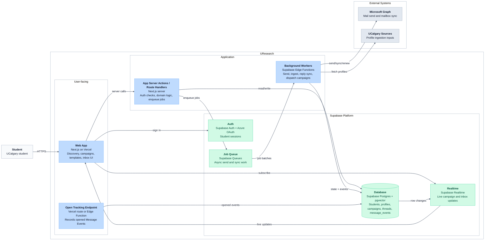

# C4 Container Diagram — UResearch

Major building blocks inside UResearch and how they communicate.

## Module to container mapping

| Module (from system design) | Primary container |
| --- | --- |
| Identity | Web + Auth + App server + `students`, `student_mailboxes` |
| Professor Discovery | Workers + `professors`, `professor_profiles`, pgvector |
| Campaigns | Web + App server + Workers + campaign tables |
| Mailbox Integration | Workers + Graph |
| Inbox | Web + Workers + thread tables |
| Workers | Supabase Edge Functions + Queue |

See [`diagrams/c4-component.md`](./diagrams/c4-component.md) for App Server module boundaries and proposed `src/modules/` layout.
