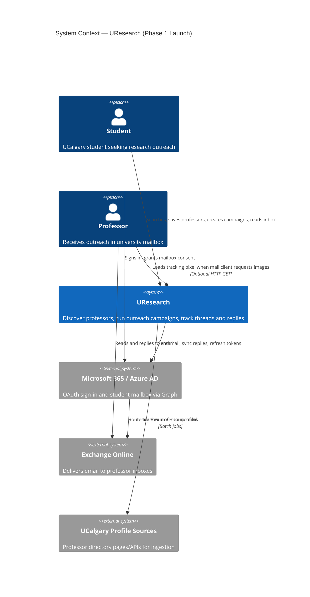

# C4 Context Diagram — UResearch

Shows UResearch in its environment: who uses it and which external systems it integrates with.

## Data flows (summary)

| Flow | Direction | Notes |
| --- | --- | --- |
| Sign-in | Student → Microsoft → UResearch | Domain validated against university allowlist |
| Discovery | Student → UResearch | Reads pre-ingested profiles only |
| Campaign send | UResearch → Graph → Professor mailbox | Sent from student mailbox address |
| Reply sync | Graph → UResearch | Webhook or delta query |
| Open signal | Professor mail client → UResearch pixel | Recorded as `opened` **Message Event** |

## Out of scope at context level

- Cross-university outreach
- Full mailbox replacement
- Phase 2 agentic/iMessage interface (same domain objects later)
