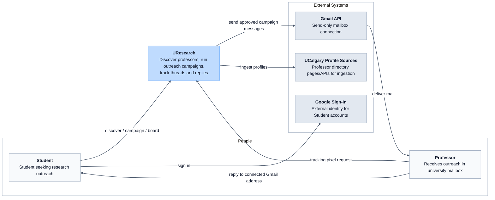

# C4 Context Diagram — UResearch

> Scope update, 2026-09-05: [ADR-0007](../../adr/0007-support-gmail-outreach-conversations.md) supersedes send-only, deferred reply-sync, and manual-reply-only statements in this earlier blueprint. Full Gmail outreach conversations are now planned for launch. This blueprint has not yet been revised for the sync implementation; use ADR-0007 and the new Gmail-conversations PRD for that work.

Shows UResearch in its environment: who uses it and which external systems it integrates with.

## Data flows (summary)

| Flow | Direction | Notes |
| --- | --- | --- |
| Sign-in | Student → Google Sign-In → UResearch | Google identity creates the Student account |
| Discovery | Student → UResearch | Reads pre-ingested profiles only |
| Campaign send | UResearch → Gmail API → Professor mailbox | Sends approved Campaign Messages from the connected Gmail mailbox |
| Reply path | Professor → Student mailbox | Replies go to the connected Gmail mailbox; UResearch does not read it at launch |
| Open signal | Professor mail client → UResearch pixel | Recorded as `opened` **Message Event** |

## Out of scope at context level

- Cross-university outreach
- Gmail inbox reading at launch
- Phase 2 agentic/iMessage interface (same domain objects later)
