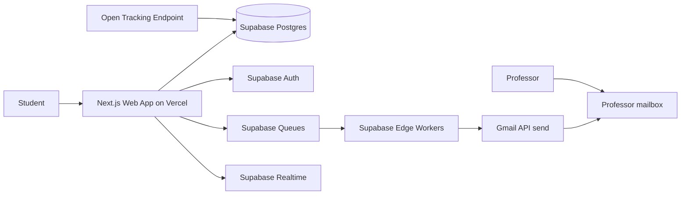

# UResearch System Design

UResearch is a campaign manager for students seeking summer research positions. For launch, the system helps a Student at the University of Calgary discover UCalgary Professor Profiles, create Outreach Campaigns, send personalized emails, and track campaign progress.

## Strategy Reset

The original Microsoft Graph delegated-permission approach is paused. A real UCalgary account reached a tenant-admin approval gate for the requested mailbox scopes, so Microsoft Graph is not a launch dependency. Launch identity uses Google sign-in, and launch outbound delivery uses Gmail send-only OAuth from the Student's connected mailbox. Gmail mailbox reading is deferred because Gmail read/modify scopes are restricted and add production verification/security requirements. See [ADR-0004](../adr/0004-pause-microsoft-graph-mailbox-integration.md) and [ADR-0006](../adr/0006-use-google-gmail-send-only-for-launch-outreach.md).

## Launch Goals

- Help Students find relevant Professors in the launch University catalog.
- Let Students create bulk Outreach Campaigns without blocking the web request.
- Send approved Campaign Messages without requiring students to draft each email themselves.
- Persist every meaningful state change so refreshes and retries are safe.
- Keep the stack cheap and fast to build.

## Non-Goals

- Full cross-university outreach at launch.
- A full email client or general-purpose inbox.
- Live scraping in the Student search path.
- Microservices from day one.
- Guaranteed confirmed-read tracking. UResearch records **Opened** from pixel **Message Events**; email clients may block or prefetch images.

## Phase Boundaries

### Phase 1

Phase 1 is the web platform: Professor discovery, Outreach Campaigns, Gmail-backed sending, an Outreach Board, and follow-up tracking.

### Phase 2

Phase 2 adds an agentic interface, potentially through iMessage. The agent should operate on the same domain objects and APIs as the web app: Students, Professor Profiles, Outreach Campaigns, Campaign Messages, Outreach Threads, and Follow-ups.

## Domain Model

The canonical product language lives in [`CONTEXT.md`](../../CONTEXT.md). The launch entity model, aggregates, and state machines live in [`data-model.md`](./data-model.md). C4 diagrams are in [`diagrams/`](./diagrams/) (context, container, component).

Launch entities:

- `Student`: domain actor; one Supabase Auth user maps one-to-one to one Student.
- `University`: professor discovery catalog; launch catalog is University of Calgary.
- `University Catalog Selection`: the Student-selected discovery catalog; at launch this is self-selected, not email-domain verified.
- `Professor`: stable internal identity; ingestion dedupes via Professor Source Keys.
- `Professor Profile`: current searchable view of a Professor.
- `Saved Professor`: student shortlist before campaigns.
- `Message Template`: reusable student-owned outreach pattern.
- `Outreach Campaign`: named batch with selected professors; optional `scheduled_for`.
- `Campaign Message`: initial personalized send per professor.
- `Student Mailbox`: the student's connected Gmail mailbox; UResearch can send from it with Gmail Send Permission, but does not read or sync it at launch.
- `Gmail Send Permission`: Google OAuth grant used to send approved Campaign Messages and Follow-ups.
- `Outreach Thread`: one conversation per student–professor pair.
- `Thread Message`: replies, follow-ups, and synced mail in a thread.
- `Message Event`: unified append-only event stream including `opened`.

## Architecture Overview

## Launch Stack

- Web app: Next.js on Vercel.
- Database: Supabase Postgres.
- Auth: Supabase Auth with Google sign-in.
- Email delivery: Gmail API send-only using the Student's connected Gmail mailbox.
- Queue: Supabase Queues.
- Workers: Supabase Edge Functions processing small queue batches.
- Realtime UI updates: Supabase Realtime, with polling fallback.
- Semantic search: Postgres-backed Professor Profile embeddings in Supabase.

The main fallback path is `QStash + Vercel Functions` if Supabase Queue or Edge Function limits become painful.

## Modules

### Identity

Owns Student identity from Google sign-in, Student profile creation, University Catalog Selection, and the Supabase Auth session. UCalgary email-domain verification is not a launch requirement.

### Professor Discovery

Owns Professor Profiles, UCalgary ingestion, enrichment, embeddings, and search. Profiles are pre-ingested and enriched before Students search.

### Campaigns

Owns Outreach Campaigns, selected Professor Profiles, message personalization, campaign approval, Campaign Message lifecycle, and follow-up scheduling.

### Delivery

Owns Gmail send-only OAuth, encrypted provider credentials, provider event logging, and any future reply detection where supported. Launch does not read or sync the Student Mailbox.

### Workers

Own queue consumers for sending, profile ingestion, follow-up scheduling, open tracking processing, and retry/dead-letter handling. Reply-sync workers are added only if a future provider or forwarding strategy supports them.

### Outreach Board

Owns Outreach Threads only. UResearch does not mirror the Student's full mailbox. A Student may manually mark a thread as replied when they see a response in Gmail.

## Core Flows

### Sign In And Email Delivery

The launch identity path is settled: Students sign in with Google and UResearch creates a matching **Student** row. Students self-select their **University Catalog Selection**; launch starts with the University of Calgary catalog and does not require a matching `@ucalgary.ca` email. Google sign-in is identity; Gmail send requires an explicit send-only OAuth grant that is requested during the create/sign-up onboarding flow. At launch, the Gmail grant must come from the same Google account used for sign-in; the OAuth callback must validate Google's stable subject identifier before creating or updating `mailbox_connections`.

The launch outbound delivery path is settled: approved **Campaign Messages** and student-approved **Follow-ups** are sent through the Student's connected Gmail **Student Mailbox** using Gmail send-only permission. Replies arrive in that Gmail mailbox. UResearch does not support secondary senders, alternate Gmail accounts, or delegated mailbox selection at launch.

Launch intentionally does not read or sync the Gmail inbox. Reply state remains optional and student-maintained through **Replied Marks**. Full Gmail reading can be revisited after the team is ready for restricted-scope verification and any required security assessment.

If a Student denies Gmail send permission during signup, or the grant is later revoked, UResearch keeps the Student signed in with limited access. Discovery, Saved Professors, Message Templates, and campaign drafts remain available. Campaign approval, dispatch, and Follow-ups are blocked until the Student restores Gmail send permission. Existing queued Campaign Messages remain queued behind a paused campaign rather than becoming failed. After reconnection, the Student must explicitly resume each affected campaign; UResearch never silently restarts it. A blocked Follow-up remains a Send Issue that the Student may retry after reconnection. Send-gated screens must show a clear Gmail connection prompt explaining that UResearch needs send-only access to send student-approved outreach and does not read Gmail at launch.

The reusable constraints remain settled: one Supabase Auth user maps to one Student, one launch Student maps to one Google sender, full outreach setup is incomplete until a matching Gmail send-only `mailbox_connections` row exists, provider credentials never reach browser code, and mailbox read/modify scopes are not requested at launch.

### Professor Profile Ingestion

1. An ingestion job crawls [UCalgary Profiles](https://profiles.ucalgary.ca): people directory for listing, individual profile pages for detail.
2. A worker normalizes departments, research interests, contact details, and profile URLs.
3. A worker generates embeddings and full-text search vectors for searchable profile text.
4. Postgres stores the Professor Profile, embedding, and search vector.
5. Student search reads from stored data only via hybrid search (semantic + keyword + filters).

**Ingestion source (settled):** UCalgary Profiles (`profiles.ucalgary.ca`). Two-phase batch job: crawl people directory → fetch each profile page. Dedupe via **Professor Source Key** — `source_type: ucalgary_profiles`, `source_id: {profile-slug}` (URL path segment, e.g. `mohamed-faizal-abdul-careem`). Include research-relevant job titles; exclude pure admin/coordinator roles unless they have research text.

**Refresh cadence (settled):** Weekly scheduled ingestion (e.g. Sunday 2am MT) plus manual trigger for initial seed and on-demand re-runs. Upsert by source key; regenerate embeddings only when `research_text` or key fields change.

**Profile visibility (settled):** Option B — searchable without email, send requires email.
- **Searchable** (indexed, appears in discovery): `display_name` + non-empty `research_text` (min ~50 chars); `department` optional; `profile_url` always set from source.
- **Campaign-ready** (can receive **Campaign Message**): email required; block at campaign add/approval if missing.
- **Skipped entirely:** no `display_name`, or `research_text` empty/too short.

**Embeddings (settled):** OpenAI `text-embedding-3-small`, 1536 dimensions. Compose at embed time: `{display_name}\nDepartment: {department or "Unknown"}\n{research_text}`. Cosine distance via pgvector HNSW index. Regenerate when `display_name`, `department`, or `research_text` changes.

**Search (settled):** Hybrid discovery at launch — not pure semantic.
- **Semantic leg:** pgvector nearest-neighbor on `embedding`.
- **Keyword leg:** Postgres full-text search (`tsvector`) on `display_name`, `department`, `research_text`.
- **Filters:** `university_id` always; optional department/faculty UI filters.
- **Merge:** Reciprocal Rank Fusion (RRF) across semantic and keyword result sets.
- **Out of scope at launch:** cross-encoder reranking, external search service.

### Professor Discovery Search

1. Student enters a query and optional filters (department, faculty).
2. App embeds the query with `text-embedding-3-small`.
3. App runs vector search and FTS in parallel, scoped to the student's **University**.
4. App merges ranked lists with RRF and returns top **Professor Profiles**.
5. Profiles without email are discoverable and savable; campaign add/send requires email.

### Campaign Creation

1. Student searches Professor Profiles.
2. Student selects Professors and a template; each selection has a draft Campaign Message representation.
3. The app resolves variables and previews personalized Campaign Messages.
4. Student may open **Customize** for one Professor and edit that resolved subject/body without changing the template or other recipients.
5. The app blocks approval when a used Student variable is missing. Missing Professor variables use readable fallbacks and highlight affected recipients for explicit review.
6. The app highlights any selected Professors with prior Outreach Threads using a user-friendly Prior Outreach Warning that includes last contact status/date and explains that a confirmed send will be added to the existing board card.
7. The app shows a projected send window based on `scheduled_for`, send pace, and the rolling 24-hour cap.
8. Student approves the Outreach Campaign, optionally sets `scheduled_for`, confirms variable warnings and prior-outreach warnings, and recipient contact plus rendered message snapshots become immutable.
9. Draft Campaign Messages transition to `queued` and dispatch jobs reference them through the connected Gmail mailbox.

**Message Template variables (settled):** Mustache-style `{{key}}` syntax is the storage representation. Launch supports:

| Placeholder | Source | Fallback if missing |
| --- | --- | --- |
| `{{professor_name}}` | `professor_profiles.display_name` | `"Professor"` |
| `{{professor_first_name}}` | Parsed from `display_name` | `"Professor"` |
| `{{professor_last_name}}` | Parsed from `display_name` | Full display name |
| `{{department}}` | `professor_profiles.department` | `"your department"` |
| `{{research_snippet}}` | First ~200 chars of `research_text`, word-boundary trim | `"your research"` |
| `{{profile_url}}` | `professor_profiles.profile_url` | Empty string |
| `{{student_name}}` | `students.display_name` | Sign-in name or `"[Your name]"` |
| `{{student_university}}` | Selected `universities.name` | `"your university"` |
| `{{student_program}}` | `students.program` | Empty string plus preview warning |
| `{{student_year}}` | `students.year_of_study` | Empty string plus preview warning |
| `{{student_signature}}` | `students.signature` | Student name |

Render at preview and approval; never leave raw placeholders in sent email. A missing Student-sourced variable blocks approval and links to the relevant profile field. A missing Professor-sourced variable uses its documented readable fallback, highlights the affected recipient, and requires explicit acknowledgement. Do not include professor email in templates — `recipient_email_snapshot` is frozen from the current Professor Profile at approval.

**Compose experience (settled):** The campaign editor resembles a simple personal-email composer: sender, subject, and a spacious body field. It has no rich-text toolbar, themes, colors, layout blocks, or newsletter styling. A searchable Variables control and typing `{{` open the same picker. Selecting a variable inserts a subtle readable token at the cursor; the stored template uses the corresponding Mustache key, but Students do not need to understand that syntax. Preview replaces tokens with one selected Professor's actual values and makes any fallback visible before final review. Student name, University, program, year of study, and plain-text signature come from reusable profile fields.

**Per-Professor customization (settled):** Final review offers a secondary **Customize** action for each Professor. It opens that Professor's resolved, token-free plain email; no Variables picker appears because the Student is editing the exact text that will be sent. Saving changes affects only that recipient and is visibly labelled Customized. If the reusable template later changes, UResearch preserves customized drafts, marks them Needs review, and shows one concise notice such as “3 customized messages were not changed.” The Student can review them or choose **Reset to template** individually. Approval is blocked until every preserved customization has been reviewed; approval then freezes the result into that Campaign Message snapshot.

**Delivery format (settled):** Approved messages are rendered as MIME `multipart/alternative`: a `text/plain` part and a minimal, visually unstyled `text/html` part containing the same escaped text and line breaks. The HTML alternative exists for normal email-client compatibility and, when enabled, the open-tracking pixel—not for presentation styling. Launch does not support arbitrary HTML, formatting controls, embedded layouts, or attachments.

**Starter templates (settled):** On first sign-in, copy three campaign defaults into the student's **Message Templates**: "General research inquiry", "Referencing specific research", "Short introduction". Also copy one follow-up default. Student-owned and editable/deletable.

### Async Sending

Campaign approval never sends email directly from the browser request. Draft Campaign Messages already represent selected Professors and any individual customizations. Approval freezes recipient/message snapshots, transitions the messages to `queued`, assigns each a `send_after` timestamp, and records lightweight dispatch jobs that reference database IDs only.

A scheduled Supabase Edge Function is the dispatcher. Supabase Cron can invoke the function on a short interval; the function reads a small due batch from Postgres/Supabase Queues, then atomically claims each eligible Campaign Message by checking:

1. The message is still `queued`.
2. `send_after <= now()` and retry backoff has elapsed.
3. The Student still has a matching connected Gmail send-only `mailbox_connections` row.
4. Per-student send pace and daily limit allow another send.
5. Prior-outreach guards are either not applicable or explicitly confirmed by the Student.

Launch send pace defaults to one outbound message every three minutes. The daily limit defaults to 200 total Campaign Messages and Follow-ups per Student per rolling 24 hours. Both values should be configurable operations policy. A student-approved Follow-up receives the next available slot ahead of queued bulk Campaign Messages; the affected campaigns' later messages move back accordingly. Campaigns that exceed the rolling cap are not rejected by default; remaining queued messages spill into the next available window.

The UI hides these queue mechanics. Final review and campaign progress show one plain-language **Expected sending window** with first- and last-send estimates. It is explicitly an estimate and updates as Follow-ups, retries, or Gmail throttling consume shared send capacity.

After claiming a message, the worker marks it `sending`, invokes Gmail send through the connected mailbox, records provider metadata and a `sent` **Message Event**, creates or attaches the **Outreach Thread**, and creates the first outbound **Thread Message**. Gmail API acceptance is UResearch's launch definition of sent. The Outreach Board card appears only after the message reaches `sent`.

If Gmail throttles or a transient worker error occurs, the worker records a retry event, increments `attempt_count`, sets `next_retry_at` with backoff, and returns the message to `queued` unless the retry ceiling is reached. If the retry ceiling is reached or the provider returns a non-retryable send error, the worker marks the Campaign Message `failed`, records a `failed` **Message Event**, and the campaign detail shows a **Send Issue** with retry or edit/retry affordances. Failed sends do not create Outreach Threads, Thread Messages, or board cards.

If Gmail access is revoked or mismatched, the worker marks the mailbox connection `reauth_required`, pauses affected campaigns, leaves their messages queued, and shows the **Gmail Connection Prompt** in campaign detail. Reconnection does not resume sending automatically; the Student reviews and resumes each campaign. Worker runs must be idempotent: if a message is already `sent` or has provider metadata, later duplicate jobs acknowledge and skip it rather than sending again.

Campaign cancellation is best effort for unsent work. Cancelling an approved or sending campaign atomically changes every still-queued Campaign Message to `cancelled`. A message already claimed as `sending` may finish; sent messages remain in history and cannot be recalled. The campaign summary reports sent, failed, and cancelled counts instead of implying that earlier sends were undone.

### Open Tracking

1. When approval creates a queued Campaign Message, it generates one opaque token and stores exactly one tracking pixel in the immutable HTML snapshot when `open_tracking_enabled` is true (default); the plain-text snapshot has no pixel.
2. UResearch previews and message-history views render the plain-text snapshot only. The worker sends the stored plain-text and HTML snapshots unchanged.
3. The tracking endpoint atomically inserts the first `opened` row with `insert ... on conflict do nothing`. A partial unique index permits at most one Opened Event per Campaign Message, including under concurrent requests.
4. The endpoint returns a valid pixel after a successful insert, a duplicate, or an insert failure. The Outreach Board derives **Opened** from the single retained event.
5. Final campaign review exposes a visible per-campaign tracking toggle; the privacy policy explains pixel tracking and its limitations. Tracking data is deleted with the Student account, and product language never treats **Opened** as confirmed reading.

### Reply State

Automated reply sync is not a launch assumption because UResearch does not read the Student Mailbox. At launch, reply state is optional and student-maintained: when a professor replies in Gmail, the Student may mark the board card as replied. That appends a `reply_marked` **Message Event**, sets `outreach_threads.status = 'replied'`, and stores `replied_at`. If a future strategy supports Gmail read/modify scopes or provider events, workers should match replies to **Outreach Threads**, append `reply_detected` **Message Events**, and move matched threads to `replied`.

Later bounce emails are handled the same way: UResearch does not read Gmail, so it cannot auto-detect them at launch. If the Student sees a bounce in Gmail after UResearch marked the message `sent`, they can mark the Outreach Thread as bounced or bad email. That appends a `bounce_marked` **Message Event**, sets `outreach_threads.status = 'closed'`, stores `closed_at` and `closed_reason`, and creates a **Contact Issue Report** for the Professor email snapshot. The report is a review signal only; it does not automatically mutate the Professor Profile.

**Second campaign to same professor (settled):** Reuse the existing **Outreach Thread** and append a new outbound **Thread Message** with `source: campaign`; `first_campaign_id` stays on the original campaign. The UI shows a Prior Outreach Warning and requires explicit confirmation. A successful new send reopens a `replied` thread, clears its current reply timestamp, and moves the card to Sent while preserving earlier reply events in history. A thread closed for `bounced` or `bad_email` remains blocked until its Contact Issue Report is resolved; other closed threads require an explicit reopen before approval.

### Follow-ups

Follow-up reminders are task cues, not automated sends. When a Student chooses to follow up, UResearch generates a **Follow-up Draft** programmatically from a follow-up Message Template, the original Campaign Message, latest outbound date, and Professor Profile context. The draft uses deterministic Mustache-style placeholders; launch does not call an AI model to write follow-ups.

The Student can edit the generated subject/body and must approve before sending. Unsent edited Follow-up Drafts are ephemeral at launch: closing the modal or page discards edits, and reopening regenerates from the template/context.

After approval, UResearch creates an outbound **Thread Message** with `source = 'follow_up'`, `status = 'queued'`, and `send_after = now()`. Follow-ups count toward the same per-Student pace and rolling 24-hour limit as Campaign Messages, but receive the next available slot ahead of queued bulk campaign work. The same Supabase Edge Worker delivery path claims the row, checks Gmail send access, send pace, retries, and reconnect state, then sends through Gmail. When Gmail accepts the send, the worker records provider metadata, sets `sent_at`, records a `follow_up_sent` **Message Event**, updates `last_activity_at`, and marks the matching Follow-up Reminder `completed`. If it fails, the issue stays on the **Outreach Thread** detail as a **Send Issue**, not a board lane.

### Outreach Board

UResearch shows one board card per **Outreach Thread** — not the student's full mailbox.

**Default lanes (settled):** Sent, Opened, Replied. Queued, sending, and failed are operational send states, not normal board lanes.

**Lane derivation (settled):** One primary lane per thread, first match wins:

| Priority | Lane | Condition |
| --- | --- | --- |
| 1 | **Replied** | `outreach_threads.status = 'replied'` from a student-maintained Replied Mark or future detected reply |
| 2 | **Opened** | `status = 'open'` AND **Opened Event** on the most recent outbound **Campaign Message** in the thread |
| 3 | **Sent** | latest outbound **Campaign Message** is `sent` and no higher-priority condition applies |

Within each lane, sort by `last_activity_at` desc. Missing **Opened Events** are normal because email clients can block or proxy tracking pixels, so there is no **Open failed** state. If `open_tracking_enabled` was false or no **Opened Event** was recorded, keep the card in **Sent** until it is marked replied or closed. A Student can mark a card **Replied** from either **Sent** or **Opened**. `closed` threads are excluded from the default board. Follow-up reminders appear as card badges or filters rather than board lanes. Failed sends appear as **Send Issues** in campaign or thread detail, not on the board.

Closed threads, including manually bounced threads, are excluded from the default board but remain accessible from thread history or filters.

## Message State Model

Each Campaign Message has a small current status:

- `draft`
- `queued`
- `sending`
- `sent`
- `failed`
- `cancelled`

Conversation outcome (`replied`) lives on the **Outreach Thread**. Detailed history lives in the unified `message_events` stream.

`failed` is an outbound-message recovery state, not an Outreach Thread state. Campaign detail is responsible for failed Campaign Messages; Outreach Thread detail is responsible for failed Follow-ups. Both surfaces show retry controls and Gmail reconnect prompts.

## Data Model

See [`data-model.md`](./data-model.md) for entities, aggregates, constraints, and state machines.

## Async Jobs

| Job | Trigger | Runtime | Notes |
| --- | --- | --- | --- |
| Professor profile ingestion | Weekly schedule + manual | Supabase Edge Worker | Crawls profiles.ucalgary.ca; upsert by source key. |
| Embedding generation | Profile changed | Supabase Edge Worker | Keep out of search request path. |
| Campaign dispatch | Campaign approved or scheduled_for due | Supabase Edge Worker + Supabase Cron/Queues | Claims due Campaign Messages in small batches and sends through the connected Gmail mailbox. |
| Reply state | Student action; future Gmail read/modify integration | Web app; future Supabase Edge Worker | Launch uses manual `reply_marked`; automated reply-state processing is deferred. |
| Open event record | Pixel request | Vercel or Supabase endpoint | Inserts `opened` into `message_events`. |
| Follow-up reminder | Latest outbound sent ≥ 7 days ago and thread is not replied/closed | Web app | Shows as card badge/filter on Sent or Opened; Student may dismiss or complete; no automated send at launch. |
| Follow-up send | Student approves a programmatic Follow-up Draft | Web app + Supabase Edge Worker | Queues an outbound Thread Message and sends through Gmail send-only path; no AI generation at launch. |

## Reliability Rules

- All workers must be idempotent.
- A queue job references database IDs, not full mutable payloads; delivery jobs point to either a Campaign Message or outbound Thread Message.
- Sending a Campaign Message must atomically check current status, due time, send access, and rate limits before invoking Gmail send.
- Failed jobs record enough detail for retry or diagnosis.
- Provider throttling should update message state and retry later, not block the campaign UI.
- Workers process small batches to stay under Edge Function limits.
- Edge Functions should be short-lived dispatchers. Large campaigns are split across repeated scheduled worker invocations instead of one long-running function call.

## Cost Rules

- Keep Professor Profile search served from stored Postgres data.
- Generate follow-up copy from deterministic templates and placeholders; do not call AI models for launch Follow-up Drafts.
- Avoid Redis at launch unless rate limiting or locks become necessary.
- Avoid dedicated worker hosts until queue volume justifies them.
- Keep logs structured but sparse, especially for open tracking and queue processing. Exception: log all reply-match misses and tier used on success for thread sync diagnostics.
- Use one queue message per Campaign Message for simple retries and observability.

## Security And Privacy

- Never expose service role keys or provider tokens to the browser.
- Use Row Level Security for Student-owned data in Supabase.
- Treat Opened Events as sensitive telemetry.
- Minimize permissions for any selected provider integration.
- Use clear consent copy for Gmail send-only access and make clear that UResearch does not read Gmail at launch.

## Implementation Sequencing

**Vertical slices:** Migrations ship per slice, not big-bang. Identity and Gmail send-only outbound delivery are settled enough for slice planning; Gmail inbox reading is deferred.

| Slice | Ships | Migrations added | Exit criteria |
| --- | --- | --- | --- |
| **1. Student foundation** | Google sign-in, Student creation, starter templates | `universities`, `students`, `message_templates` | Student can sign in with Google and get a UResearch profile |
| **2. Discovery** | Manual ingestion, hybrid search, discovery UI | `professors`, `professor_source_keys`, `professor_profiles`, `saved_professors` | Student searches and saves professors |
| **3. Campaign send** | Templates, draft/approve, Gmail send-only delivery | `mailbox_connections`, `outreach_campaigns`, `campaign_messages`, queues if needed | Approved campaign sends through the connected Gmail mailbox |
| **4. Outreach Board + reply tracking** | Manual replied marks, board UI | `outreach_threads`, `thread_messages`, `message_events` (partial) | Students can mark replies; replied threads sort first |
| **5. Open pixel** | Tracking endpoint, **Opened** chip | `message_events` (`opened`), pixel route | Open signal recorded (best-effort) |

**Migration strategy (settled):** `data-model.md` is the blueprint; Supabase migrations land just-in-time per slice. Do not migrate the full schema before slice 1 — only what that slice needs. Expand schema as features ship; avoid unused tables and speculative columns.

Module boundaries and folder layout: [`diagrams/c4-component.md`](./diagrams/c4-component.md).
