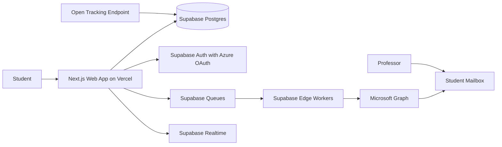

# UResearch System Design

UResearch is a campaign manager and focused inbox for students seeking summer research positions. For launch, the system helps a Student at the University of Calgary discover UCalgary Professor Profiles, create Outreach Campaigns, send personalized emails through the Student's university mailbox, and track campaign progress, opens, replies, and follow-ups.

## Launch Goals

- Help Students find relevant Professors at their own University.
- Let Students create bulk Outreach Campaigns without blocking the web request.
- Send Campaign Messages through the Student Mailbox for trust and reply continuity.
- Persist every meaningful state change so refreshes and retries are safe.
- Keep the stack cheap and fast to build.

## Non-Goals

- Full cross-university outreach at launch.
- A full Outlook replacement or general-purpose inbox.
- Live scraping in the Student search path.
- Microservices from day one.
- Guaranteed confirmed-read tracking. UResearch records **Opened** from pixel **Message Events**; Outlook may block or prefetch images.

## Phase Boundaries

### Phase 1

Phase 1 is the web platform: Professor discovery, Outreach Campaigns, async sending, campaign-focused inbox, and follow-up tracking.

### Phase 2

Phase 2 adds an agentic interface, potentially through iMessage. The agent should operate on the same domain objects and APIs as the web app: Students, Professor Profiles, Outreach Campaigns, Campaign Messages, Outreach Threads, and Follow-ups.

## Domain Model

The canonical product language lives in [`CONTEXT.md`](../../CONTEXT.md). The launch entity model, aggregates, and state machines live in [`data-model.md`](./data-model.md). C4 diagrams are in [`diagrams/`](./diagrams/) (context, container, component).

Launch entities:

- `Student`: domain actor; one Supabase Auth user maps one-to-one to one Student.
- `University`: inferred from email domain against an allowlist; launch allows `@ucalgary.ca`.
- `Professor`: stable internal identity; ingestion dedupes via Professor Source Keys.
- `Professor Profile`: current searchable view of a Professor.
- `Saved Professor`: student shortlist before campaigns.
- `Message Template`: reusable student-owned outreach pattern.
- `Outreach Campaign`: named batch with selected professors; optional `scheduled_for`.
- `Campaign Message`: initial personalized send per professor.
- `Student Mailbox`: connected Microsoft 365 mailbox.
- `Outreach Thread`: one conversation per student–professor pair.
- `Thread Message`: replies, follow-ups, and synced mail in a thread.
- `Message Event`: unified append-only event stream including `opened`.

## Architecture Overview

## Launch Stack

- Web app: Next.js on Vercel.
- Database: Supabase Postgres.
- Auth: Supabase Auth with Azure OAuth for Microsoft sign-in and mailbox consent.
- Mailbox API: Microsoft Graph.
- Queue: Supabase Queues.
- Workers: Supabase Edge Functions processing small queue batches.
- Realtime UI updates: Supabase Realtime, with polling fallback.
- Semantic search: Postgres-backed Professor Profile embeddings in Supabase.

The main fallback path is `QStash + Vercel Functions` if Supabase Queue or Edge Function limits become painful.

## Modules

### Identity

Owns Student identity, University inference from email domain, Azure OAuth session, and mailbox consent. For launch, Microsoft sign-in and mailbox consent are one combined flow.

### Professor Discovery

Owns Professor Profiles, UCalgary ingestion, enrichment, embeddings, and search. Profiles are pre-ingested and enriched before Students search.

### Campaigns

Owns Outreach Campaigns, selected Professor Profiles, message personalization, campaign approval, Campaign Message lifecycle, and follow-up scheduling.

### Mailbox Integration

Owns Microsoft Graph sending, reply detection, thread matching, provider tokens, token refresh, webhook-based inbox sync, subscription renewal, and provider event logging.

### Workers

Own queue consumers for sending, profile ingestion, reply sync, follow-up scheduling, open tracking processing, and retry/dead-letter handling.

### Inbox

Owns Outreach Threads only. UResearch does not mirror the Student's full mailbox.

## Core Flows

### Sign In And Connect Mailbox

1. Student signs in with Microsoft/Azure OAuth.
2. UResearch requests delegated scopes in one consent screen: `openid`, `profile`, `email`, `User.Read`, `Mail.Send`, `Mail.Read`, `offline_access`.
3. The app validates the Student's university email domain.
4. The app creates or updates the Student and Student Mailbox records.
5. Microsoft refresh tokens are stored in Supabase Vault; `student_mailboxes.refresh_token_ref` holds the vault secret ID. Workers read tokens via service role only.

**Token storage (settled):** Supabase Vault (`vault.secrets`) for Microsoft refresh tokens. On OAuth callback, insert token into vault with metadata (`student_id`, `provider: microsoft`); store returned secret UUID in `refresh_token_ref`. On rotation, update the vault secret in place. On revoke, delete vault secret and set `consent_status = revoked`. Access tokens stay in worker memory only.

**Scope rationale (settled):**

- `Mail.Send` — send **Campaign Messages** and manual **Thread Message** replies from the **Student Mailbox**.
- `Mail.Read` — read inbox for reply sync and mail change notification subscriptions; `Mail.ReadWrite` is not needed because UResearch does not move, flag, or delete mail.
- `offline_access` — refresh tokens for async workers without the student being online.
- Do not request application permissions or `Mail.ReadBasic` at launch.

**App registration (settled):** Multi-tenant (`AzureADMultipleOrgs`) app registered in UResearch's Azure tenant. OAuth authority: `https://login.microsoftonline.com/organizations` (work/school accounts only). UResearch enforces the launch boundary via **University** email domain allowlist in app code — not via Azure `signInAudience`.

**Consent assumption (settled):** Launch assumes individual user consent at sign-in works for `@ucalgary.ca` students. Do not pursue tenant admin consent or UCalgary IT pre-approval as a launch path. Complete Microsoft publisher verification for trust on the consent screen. Validate with real student accounts before broad launch. If user consent is blocked by tenant policy, pivot auth/mailbox strategy rather than pursuing admin consent.

### Professor Profile Ingestion

1. An ingestion job crawls [UCalgary Profiles](https://profiles.ucalgary.ca): people directory for listing, individual profile pages for detail.
2. A worker normalizes departments, research interests, contact details, and profile URLs.
3. A worker generates embeddings and full-text search vectors for searchable profile text.
4. Postgres stores the Professor Profile, embedding, and search vector.
5. Student search reads from stored data only via hybrid search (semantic + keyword + filters).

**Ingestion source (settled):** UCalgary Profiles (`profiles.ucalgary.ca`). Two-phase batch job: crawl people directory → fetch each profile page. Dedupe via **Professor Source Key** — `source_type: ucalgary_profiles`, `source_id: {profile-slug}` (URL path segment, e.g. `mohamed-faizal-abdul-careem`). Include research-relevant job titles; exclude pure admin/coordinator roles unless they have research text.

**Refresh cadence (settled):** Weekly scheduled ingestion (e.g. Sunday 2am MT) plus manual trigger for initial seed and on-demand re-runs. Upsert by source key; regenerate embeddings only when `research_text` or key fields change.

**Profile visibility (settled):** Option B — searchable without email, send requires email.
- **Searchable** (indexed, appears in discovery): `display_name` + non-empty `research_text` (min ~50 chars); `department` optional; `profile_url` always set from source.
- **Campaign-ready** (can receive **Campaign Message**): email required; block at campaign add/approval if missing.
- **Skipped entirely:** no `display_name`, or `research_text` empty/too short.

**Embeddings (settled):** OpenAI `text-embedding-3-small`, 1536 dimensions. Compose at embed time: `{display_name}\nDepartment: {department or "Unknown"}\n{research_text}`. Cosine distance via pgvector HNSW index. Regenerate when `display_name`, `department`, or `research_text` changes.

**Search (settled):** Hybrid discovery at launch — not pure semantic.
- **Semantic leg:** pgvector nearest-neighbor on `embedding`.
- **Keyword leg:** Postgres full-text search (`tsvector`) on `display_name`, `department`, `research_text`.
- **Filters:** `university_id` always; optional department/faculty UI filters.
- **Merge:** Reciprocal Rank Fusion (RRF) across semantic and keyword result sets.
- **Out of scope at launch:** cross-encoder reranking, external search service.

### Professor Discovery Search

1. Student enters a query and optional filters (department, faculty).
2. App embeds the query with `text-embedding-3-small`.
3. App runs vector search and FTS in parallel, scoped to the student's **University**.
4. App merges ranked lists with RRF and returns top **Professor Profiles**.
5. Profiles without email are discoverable and savable; campaign add/send requires email.

### Campaign Creation

1. Student searches Professor Profiles.
2. Student selects Professors and a template.
3. The app generates or previews personalized Campaign Messages.
4. Student approves the Outreach Campaign, optionally sets `scheduled_for`, and snapshots become immutable.
5. The app creates Campaign Message rows in `queued` state and enqueues send jobs (immediately or at scheduled time via UResearch workers, not Outlook deferred send).

**Message Template placeholders (settled):** Mustache-style `{{key}}` syntax. Six launch placeholders:

| Placeholder | Source | Fallback if missing |
| --- | --- | --- |
| `{{professor_name}}` | `professor_profiles.display_name` | `"Professor"` |
| `{{professor_first_name}}` | Parsed from `display_name` | `"Professor"` |
| `{{department}}` | `professor_profiles.department` | `"your department"` |
| `{{research_snippet}}` | First ~200 chars of `research_text`, word-boundary trim | `"your research"` |
| `{{profile_url}}` | `professor_profiles.profile_url` | Empty string |
| `{{student_name}}` | `students.display_name` | Sign-in name or `"[Your name]"` |

Render at preview and approval; never leave raw placeholders in sent email. Do not include professor email in templates — `recipient_email_snapshot` is set at send time.

**Starter templates (settled):** On first sign-in, copy three system defaults into the student's **Message Templates**: "General research inquiry", "Referencing specific research", "Short introduction". Student-owned and editable/deletable.

### Async Sending

1. A Supabase Edge Worker reads a small batch from Supabase Queues.
2. For each Campaign Message, the worker marks it `sending`.
3. The worker sends through Microsoft Graph using the Student Mailbox.
4. The worker marks the message `sent` or `failed` and records provider metadata.
5. Supabase Realtime pushes row changes to the campaign UI.
6. If the browser refreshes, the UI reloads current state from Postgres.

### Open Tracking

1. Sent messages include a tracking pixel URL when `open_tracking_enabled` is true (default).
2. The tracking endpoint appends a `opened` row to `message_events`.
3. The inbox shows **Opened** from the unified event stream.
4. Workers dedupe preview-pane and prefetch noise where possible; `reply_detected` remains the strong engagement signal.

### Reply Sync

1. On mailbox connect, UResearch creates a Graph change notification subscription on `me/mailFolders('Inbox')/messages` (`changeType: created`).
2. The webhook endpoint validates Graph handshake requests, acknowledges notifications quickly, and enqueues reply-sync jobs.
3. Reply-sync workers fetch new messages, match them to **Outreach Threads**, and record `reply_detected` **Message Events**; matched threads move to `replied`.
4. A subscription renewal worker renews inbox subscriptions before expiry (~3-day max lifetime for mail).
5. Student can reply from UResearch through the same **Student Mailbox**.

**Reply sync (settled):** Webhooks only at launch — no delta-query polling fallback. Reliability comes from a robust webhook endpoint, subscription renewal, and idempotent reply matching — not scheduled inbox polling.

**Reply matching (settled):** Three-tier cascade for inbound messages (ignore student's own outbound copies and already-processed `graph_message_id`):

1. `conversationId` matches `campaign_messages.graph_conversation_id` or a **Thread Message** in the thread.
2. `In-Reply-To` / `internetMessageId` matches `graph_message_id` on a sent **Campaign Message** or **Thread Message**.
3. Subject heuristic — sender matches `recipient_email_snapshot` AND normalized subject matches `subject_snapshot` (strip `Re:` / `Fwd:` prefixes).

No match → ignore (do not create orphan threads). Emit structured worker logs on every inbound sync attempt: tier matched (1–3) on success; on miss, log `reply_match_miss` with `graph_message_id`, `conversationId`, sender, subject, and tiers tried — for diagnosing header-breaking edge cases. Not persisted in `message_events` (ops telemetry only).

**Second campaign to same professor (settled):** Reuse existing **Outreach Thread** (Option A). New **Campaign Message** attaches to the same thread; append outbound **Thread Message** with `source: campaign`. `first_campaign_id` stays on the original campaign. UI may show prior contact warning; if thread is `replied`, warn before send but allow it.

### Inbox

UResearch shows **Outreach Threads** only — not the student's full mailbox.

**Default sort (settled):** Replied threads first (`status = 'replied'`, by `last_activity_at` desc), then all other open threads by `last_activity_at` desc. Students should see professors who wrote back at the top.

**Status chip (settled):** One primary chip per thread, first match wins:

| Priority | Chip | Condition |
| --- | --- | --- |
| 1 | **Replied** | `outreach_threads.status = 'replied'` |
| 2 | **Opened** | `status = 'open'` AND **Opened Event** on the most recent outbound **Campaign Message** in the thread |
| 3 | **No reply · Nd** | `status = 'open'`, latest outbound sent ≥ 7 days ago, no **Opened Event** on that message |
| 4 | *(none)* | Recent send, no open yet |

If `open_tracking_enabled` was false on the sending campaign, skip **Opened** (go to **No reply · Nd** after 7 days). `closed` threads excluded from default inbox list. **No reply · Nd** is the visual cue for manual **Follow-ups**.

## Message State Model

Each Campaign Message has a small current status:

- `draft`
- `queued`
- `sending`
- `sent`
- `failed`

Conversation outcome (`replied`) lives on the **Outreach Thread**. Detailed history lives in the unified `message_events` stream.

## Data Model

See [`data-model.md`](./data-model.md) for entities, aggregates, constraints, and state machines.

## Async Jobs

| Job | Trigger | Runtime | Notes |
| --- | --- | --- | --- |
| Professor profile ingestion | Weekly schedule + manual | Supabase Edge Worker | Crawls profiles.ucalgary.ca; upsert by source key. |
| Embedding generation | Profile changed | Supabase Edge Worker | Keep out of search request path. |
| Campaign dispatch | Campaign approved or scheduled_for due | Supabase Edge Worker | UResearch-owned schedule; Graph sendMail at dispatch time. |
| Reply sync | Graph change notification | Supabase Edge Worker | Webhook enqueues job; no delta polling at launch. |
| Subscription renewal | Scheduled (~daily) | Supabase Edge Worker | Renew mail inbox subscriptions before expiry. |
| Open event record | Pixel request | Vercel or Supabase endpoint | Inserts `opened` into `message_events`. |
| Follow-up reminder | Manual student action | Web app | No automated send at launch. |

## Reliability Rules

- All workers must be idempotent.
- A queue job references database IDs, not full mutable payloads.
- Sending a Campaign Message must check current status before calling Graph.
- Failed jobs record enough detail for retry or diagnosis.
- Provider throttling should update message state and retry later, not block the campaign UI.
- Workers process small batches to stay under Edge Function limits.
- Graph inbox subscriptions must be renewed before expiry; treat lapsed subscriptions as an operational alert.

## Cost Rules

- Keep Professor Profile search served from stored Postgres data.
- Avoid Redis at launch unless rate limiting or locks become necessary.
- Avoid dedicated worker hosts until queue volume justifies them.
- Keep logs structured but sparse, especially for open tracking and queue processing. Exception: log all reply-match misses and tier used on success for thread sync diagnostics.
- Use one queue message per Campaign Message for simple retries and observability.

## Security And Privacy

- Store Microsoft refresh tokens in Supabase Vault; never in RLS-readable columns or the browser.
- Never expose service role keys or provider tokens to the browser.
- Use Row Level Security for Student-owned data in Supabase.
- Treat Opened Events as sensitive telemetry.
- Respect mailbox scope minimization: UResearch only manages Outreach Threads.
- Use clear consent copy for mailbox sending and reply tracking.

## Implementation Sequencing

**Vertical slices (settled):** Auth-first because user consent is the launch gate. Migrations ship per slice — not big-bang.

| Slice | Ships | Migrations added | Exit criteria |
| --- | --- | --- | --- |
| **1. Auth + mailbox** | Microsoft sign-in, domain gate, Vault tokens, starter templates | `universities`, `students`, `student_mailboxes`, `message_templates` (seed) | Real `@ucalgary.ca` account signs in; token in Vault; Graph calls succeed |
| **2. Discovery** | Manual ingestion, hybrid search, discovery UI | `professors`, `professor_source_keys`, `professor_profiles`, `saved_professors` | Student searches and saves professors |
| **3. Campaign send** | Templates, draft/approve, queue worker, Graph send | `outreach_campaigns`, `campaign_messages`, queues | Approved campaign sends from student mailbox |
| **4. Inbox + reply sync** | Webhook, three-tier matching, thread UI | `outreach_threads`, `thread_messages`, `message_events` (partial) | Reply appears; replied threads sort first |
| **5. Open pixel** | Tracking endpoint, **Opened** chip | `message_events` (`opened`), pixel route | Open signal recorded (best-effort) |

**Migration strategy (settled):** `data-model.md` is the blueprint; Supabase migrations land just-in-time per slice. Do not migrate the full schema before slice 1 — only what that slice needs. Expand schema as features ship; avoid unused tables and speculative columns.

Module boundaries and folder layout: [`diagrams/c4-component.md`](./diagrams/c4-component.md).
