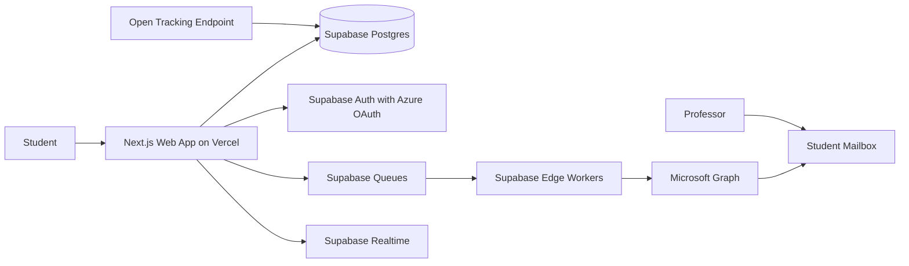

# UResearch System Design

UResearch is a campaign manager and focused inbox for students seeking summer research positions. For launch, the system helps a Student at the University of Calgary discover UCalgary Professor Profiles, create Outreach Campaigns, send personalized emails through the Student's university mailbox, and track campaign progress, opens, replies, and follow-ups.

## Launch Goals

- Help Students find relevant Professors at their own University.
- Let Students create bulk Outreach Campaigns without blocking the web request.
- Send Campaign Messages through the Student Mailbox for trust and reply continuity.
- Persist every meaningful state change so refreshes and retries are safe.
- Keep the stack cheap and fast to build.

## Non-Goals

- Full cross-university outreach at launch.
- A full Outlook replacement or general-purpose inbox.
- Live scraping in the Student search path.
- Microservices from day one.
- Guaranteed confirmed-read tracking. UResearch records **Opened** from pixel **Message Events**; Outlook may block or prefetch images.

## Phase Boundaries

### Phase 1

Phase 1 is the web platform: Professor discovery, Outreach Campaigns, async sending, campaign-focused inbox, and follow-up tracking.

### Phase 2

Phase 2 adds an agentic interface, potentially through iMessage. The agent should operate on the same domain objects and APIs as the web app: Students, Professor Profiles, Outreach Campaigns, Campaign Messages, Outreach Threads, and Follow-ups.

## Domain Model

The canonical product language lives in [`CONTEXT.md`](../../CONTEXT.md). The launch entity model, aggregates, and state machines live in [`data-model.md`](./data-model.md). C4 diagrams are in [`diagrams/`](./diagrams/).

Launch entities:

- `Student`: domain actor; one Supabase Auth user maps one-to-one to one Student.
- `University`: inferred from email domain against an allowlist; launch allows `@ucalgary.ca`.
- `Professor`: stable internal identity; ingestion dedupes via Professor Source Keys.
- `Professor Profile`: current searchable view of a Professor.
- `Saved Professor`: student shortlist before campaigns.
- `Message Template`: reusable student-owned outreach pattern.
- `Outreach Campaign`: named batch with selected professors; optional `scheduled_for`.
- `Campaign Message`: initial personalized send per professor.
- `Student Mailbox`: connected Microsoft 365 mailbox.
- `Outreach Thread`: one conversation per student–professor pair.
- `Thread Message`: replies, follow-ups, and synced mail in a thread.
- `Message Event`: unified append-only event stream including `opened`.

## Architecture Overview

## Launch Stack

- Web app: Next.js on Vercel.
- Database: Supabase Postgres.
- Auth: Supabase Auth with Azure OAuth for Microsoft sign-in and mailbox consent.
- Mailbox API: Microsoft Graph.
- Queue: Supabase Queues.
- Workers: Supabase Edge Functions processing small queue batches.
- Realtime UI updates: Supabase Realtime, with polling fallback.
- Semantic search: Postgres-backed Professor Profile embeddings in Supabase.

The main fallback path is `QStash + Vercel Functions` if Supabase Queue or Edge Function limits become painful.

## Modules

### Identity

Owns Student identity, University inference from email domain, Azure OAuth session, and mailbox consent. For launch, Microsoft sign-in and mailbox consent are one combined flow.

### Professor Discovery

Owns Professor Profiles, UCalgary ingestion, enrichment, embeddings, and search. Profiles are pre-ingested and enriched before Students search.

### Campaigns

Owns Outreach Campaigns, selected Professor Profiles, message personalization, campaign approval, Campaign Message lifecycle, and follow-up scheduling.

### Mailbox Integration

Owns Microsoft Graph sending, reply detection, thread matching, provider tokens, token refresh, webhook or delta-query sync, and provider event logging.

### Workers

Own queue consumers for sending, profile ingestion, reply sync, follow-up scheduling, open tracking processing, and retry/dead-letter handling.

### Inbox

Owns Outreach Threads only. UResearch does not mirror the Student's full mailbox.

## Core Flows

### Sign In And Connect Mailbox

1. Student signs in with Microsoft/Azure OAuth.
2. UResearch requests identity, email, offline access, and Graph mailbox scopes.
3. The app validates the Student's university email domain.
4. The app creates or updates the Student and Student Mailbox records.
5. Provider refresh tokens are stored server-side only and refreshed by backend code when Graph calls need new access tokens.

### Professor Profile Ingestion

1. An ingestion job collects UCalgary Professor Profile source data.
2. A worker normalizes departments, research interests, contact details, and profile URLs.
3. A worker generates embeddings for searchable profile text.
4. Postgres stores the Professor Profile and search vector.
5. Student search reads from stored data only.

### Campaign Creation

1. Student searches Professor Profiles.
2. Student selects Professors and a template.
3. The app generates or previews personalized Campaign Messages.
4. Student approves the Outreach Campaign, optionally sets `scheduled_for`, and snapshots become immutable.
5. The app creates Campaign Message rows in `queued` state and enqueues send jobs (immediately or at scheduled time via UResearch workers, not Outlook deferred send).

### Async Sending

1. A Supabase Edge Worker reads a small batch from Supabase Queues.
2. For each Campaign Message, the worker marks it `sending`.
3. The worker sends through Microsoft Graph using the Student Mailbox.
4. The worker marks the message `sent` or `failed` and records provider metadata.
5. Supabase Realtime pushes row changes to the campaign UI.
6. If the browser refreshes, the UI reloads current state from Postgres.

### Open Tracking

1. Sent messages include a tracking pixel URL when `open_tracking_enabled` is true (default).
2. The tracking endpoint appends a `opened` row to `message_events`.
3. The inbox shows **Opened** from the unified event stream.
4. Workers dedupe preview-pane and prefetch noise where possible; `reply_detected` remains the strong engagement signal.

### Reply Sync

1. UResearch receives Microsoft Graph mailbox change notifications or runs delta-query sync.
2. Sync jobs identify replies related to Outreach Threads.
3. The app records `reply_detected` **Message Events** and marks the **Outreach Thread** as `replied`.
4. Student can reply from UResearch through the same Student Mailbox.

## Message State Model

Each Campaign Message has a small current status:

- `draft`
- `queued`
- `sending`
- `sent`
- `failed`

Conversation outcome (`replied`) lives on the **Outreach Thread**. Detailed history lives in the unified `message_events` stream.

## Data Model

See [`data-model.md`](./data-model.md) for entities, aggregates, constraints, and state machines.

## Async Jobs

| Job | Trigger | Runtime | Notes |
| --- | --- | --- | --- |
| Professor profile ingestion | Manual or scheduled | Supabase Edge Worker | Launch starts with UCalgary. |
| Embedding generation | Profile changed | Supabase Edge Worker | Keep out of search request path. |
| Campaign dispatch | Campaign approved or scheduled_for due | Supabase Edge Worker | UResearch-owned schedule; Graph sendMail at dispatch time. |
| Reply sync | Graph notification or schedule | Supabase Edge Worker | Use webhook first, delta query as recovery. |
| Open event record | Pixel request | Vercel or Supabase endpoint | Inserts `opened` into `message_events`. |
| Follow-up reminder | Manual student action | Web app | No automated send at launch. |

## Reliability Rules

- All workers must be idempotent.
- A queue job references database IDs, not full mutable payloads.
- Sending a Campaign Message must check current status before calling Graph.
- Failed jobs record enough detail for retry or diagnosis.
- Provider throttling should update message state and retry later, not block the campaign UI.
- Workers process small batches to stay under Edge Function limits.

## Cost Rules

- Keep Professor Profile search served from stored Postgres data.
- Avoid Redis at launch unless rate limiting or locks become necessary.
- Avoid dedicated worker hosts until queue volume justifies them.
- Keep logs structured but sparse, especially for open tracking and queue processing.
- Use one queue message per Campaign Message for simple retries and observability.

## Security And Privacy

- Store Microsoft provider refresh tokens server-side only.
- Never expose service role keys or provider tokens to the browser.
- Use Row Level Security for Student-owned data in Supabase.
- Treat Opened Events as sensitive telemetry.
- Respect mailbox scope minimization: UResearch only manages Outreach Threads.
- Use clear consent copy for mailbox sending and reply tracking.

## Open Questions

- The first UCalgary profile ingestion source and refresh cadence.
- Whether Microsoft Graph permissions can pass app verification/admin consent for the launch audience.
