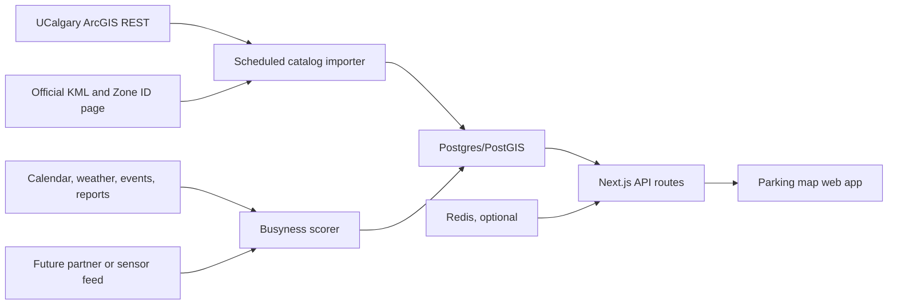

# UCalgary parking availability data: feasibility report

**Research date:** 2026-08-09  
**Scope:** Public, unauthenticated, read-only sources that could support a web app which shows current or estimated University of Calgary parking availability. Payment, ticket, account, plate, and private operator workflows are out of scope.

## 1. Executive conclusion

**Can we currently obtain live UCalgary parking occupancy from a simple public endpoint? NO.**

**Can we build a useful parking web app from public data? PARTIALLY.** We can build an authoritative lot map and add an explicitly labelled busyness estimate. We cannot honestly show exact live available stalls from the public sources tested.

What is available now:

1. A simple public ArcGIS REST endpoint returns 68 UCalgary parking points with lot names and coordinates.
2. A public Google My Maps KML export returns about 68 parking markers with rates and parking restrictions.
3. UCalgary publishes 36 Parkedin Zone IDs and three parkade capacities.
4. The public permit portal exposes product sale state such as `sold_out`, but that describes permit inventory, not free stalls now.
5. Parkedin has internal location and reservation operations. Its public web client sends encrypted application envelopes to one API root. A reproduced guest request returned UCalgary location metadata and internal IDs, but no stall capacity, occupied stalls, available stalls, or current full/not-full state.

The shortest path to a truthful product is:

- **Phase 1:** Publish the lot catalog and an `estimated_busyness` score with confidence and source timestamps.
- **Phase 2:** Get aggregate occupancy or active-session data from UCalgary or Precise ParkLink, or install entrance counters at a small set of lots.
- **Do not:** Present permit availability, Parkedin payment sessions, or a statistical estimate as exact live availability.

## 2. Best data sources, ranked

| Rank | Source | Data | Freshness | Authority | Use in the app |
|---:|---|---|---|---|---|
| 1 | [UCalgary ArcGIS Parking Points FeatureServer](https://services5.arcgis.com/oegdSE8JU1e7fUHu/arcgis/rest/services/Parking_Points/FeatureServer/0) | Lot name, point geometry, type, details | Layer modified 2025-08-22 when inspected | UCalgary ArcGIS organization | Canonical map seed and periodic geometry sync |
| 2 | [UCalgary Parkedin Zone IDs](https://www.ucalgary.ca/ancillary/parking/parkedin/parkedin-zone-ids) | 36 official lot-to-zone mappings | Current public page | UCalgary | Join key for Parkedin zones |
| 3 | [UCalgary Find Parking](https://www.ucalgary.ca/ancillary/parking/parking-permits/find-parking) and its public KML | Coordinates, rates, parking type, time restrictions | Page and map can change without versioning | UCalgary | Enrich the lot catalog; validate ArcGIS points |
| 4 | [UCalgary Visitor/Events Parking](https://www.ucalgary.ca/ancillary/parking/visitorevents-parking) | Published capacities for ART, MSC, and CWPH parkades | Current public page | UCalgary | Capacity seed for three parkades only |
| 5 | [UCalgary permit portal](https://parking.ucalgary.ca/) | Permit products and sale state | Request-time | UCalgary AIMS portal | Low-weight permit-demand signal only |
| 6 | [Parkedin web app](https://parkedin.com/) | Guest zone lookup and payment tariffs | Request-time | Precise ParkLink | Zone validation and rates, subject to permission; no verified occupancy field |
| 7 | Public student-created ArcGIS polygon layers | Lot polygons or areas for a few lots | Irregular | Not authoritative | Experimental geometry fallback only |

## 3. Public endpoints

### 3.1 ArcGIS layer metadata

**Classification:** A — documented public API on an authoritative public service.  
**Authentication:** None.  
**Useful for live availability:** No. Static metadata only.

```http
GET https://services5.arcgis.com/oegdSE8JU1e7fUHu/arcgis/rest/services/Parking_Points/FeatureServer/0?f=pjson
```

The observed fields were:

```json
[
  {"name":"OBJECTID","type":"esriFieldTypeOID"},
  {"name":"NAME","type":"esriFieldTypeString"},
  {"name":"TYPE","type":"esriFieldTypeString"},
  {"name":"DETAILS","type":"esriFieldTypeString"}
]
```

### 3.2 ArcGIS parking-point query

**Classification:** A — documented public API.  
**Authentication:** None.  
**Useful for live availability:** No. Best simple endpoint for the lot catalog.

```http
GET https://services5.arcgis.com/oegdSE8JU1e7fUHu/arcgis/rest/services/Parking_Points/FeatureServer/0/query
    ?where=1%3D1
    &outFields=OBJECTID%2CNAME%2CTYPE%2CDETAILS
    &returnGeometry=true
    &outSR=4326
    &f=pjson
```

Reproduction:

```bash
curl -sG \
  'https://services5.arcgis.com/oegdSE8JU1e7fUHu/arcgis/rest/services/Parking_Points/FeatureServer/0/query' \
  --data-urlencode 'where=1=1' \
  --data-urlencode 'outFields=OBJECTID,NAME,TYPE,DETAILS' \
  --data-urlencode 'returnGeometry=true' \
  --data-urlencode 'outSR=4326' \
  --data-urlencode 'f=pjson'
```

Sanitized observed response:

```json
{
  "features": [
    {
      "attributes": {
        "OBJECTID": 1,
        "NAME": "Lot 10",
        "TYPE": "Parking",
        "DETAILS": null
      },
      "geometry": {
        "x": -114.13895408001996,
        "y": 51.08009464295892
      }
    }
  ]
}
```

The query returned 68 features when inspected. There were no capacity, occupancy, availability, timestamp, counter, or status fields.

### 3.3 Official Google My Maps KML export

**Classification:** C — public export from UCalgary's embedded public map.  
**Authentication:** None.  
**Useful for live availability:** No. Useful for rates and restrictions.

```http
GET https://www.google.com/maps/d/kml?mid=1SKvB_mYvKDPNE9PoflFtEE8PsqzkG4Ym&forcekml=1
```

Reproduction:

```bash
curl -L \
  'https://www.google.com/maps/d/kml?mid=1SKvB_mYvKDPNE9PoflFtEE8PsqzkG4Ym&forcekml=1' \
  -o ucalgary-parking.kml
```

Observed placemark:

```xml
<Placemark>
  <name>Lot 10 - Public - Flat rate ($10.50)</name>
  <Point><coordinates>-114.138959,51.0800939,0</coordinates></Point>
</Placemark>
```

The KML is useful but less stable than ArcGIS REST. UCalgary can edit labels, prices, and map structure without an API version change. Cache the result, retain the last valid copy, and review the website terms before production polling.

### 3.4 UCalgary AIMS permit wizard

**Classification:** B — undocumented but publicly callable web endpoint.  
**Authentication:** None for the initial product calculation tested.  
**Useful for live availability:** No. It reports permit-sale availability, not parking stalls.

```http
POST https://parking.ucalgary.ca/api/wizard/index.php
Content-Type: application/x-www-form-urlencoded

cmd=calculate_wizard_item&
page_cmd=new_non_auth&
wizard_name=permit_request&
wizard_item_name=&
last_displayed_name=&
waitlistoid=&
interface_code=
```

Reproduction:

```bash
curl -s \
  'https://parking.ucalgary.ca/api/wizard/index.php' \
  -H 'Content-Type: application/x-www-form-urlencoded' \
  --data 'cmd=calculate_wizard_item&page_cmd=new_non_auth&wizard_name=permit_request&wizard_item_name=&last_displayed_name=&waitlistoid=&interface_code='
```

Sanitized observed response:

```json
{
  "name": "P_INIT_WIZARD",
  "TODAY": "2026-08-09 18:48:51 -0600",
  "category_permit_types": [
    {
      "ptypes": [
        {
          "_id": 762,
          "description": "McMahon East (Aug 2026)",
          "has_inventory": false,
          "use_inventory_on_web": true,
          "sold_out": false,
          "require_location": true,
          "locks": []
        }
      ]
    }
  ]
}
```

Important limits:

- `sold_out` is a permit-product sales state. It is not evidence that the lot is full or empty now.
- The public portal also announced that Art Parkade and Lot 10 semester permits were sold out. This may be a useful semester-demand feature, but it still cannot produce current free-stall counts.
- This endpoint is undocumented. Treat its schema as unstable, poll slowly, cache results, and stop if the operator objects.

### 3.5 Parkedin guest API

**Classification:** D — public UI backed by an undocumented application protocol.  
**Authentication:** Guest access is possible after accepting the public privacy and fee notice.  
**Useful for live availability:** Not verified for UCalgary.

The public configuration selects:

```text
API scheme: https
API host:   parkedin.com
API port:   8080
API root:   https://parkedin.com:8080/
```

The guest client uses the custom HTTP method `PARKEDIN` against that single root. The request and response use an application-level AES-CBC encrypted envelope. It is not a conventional JSON REST endpoint.

The public client bundle contains operation names such as:

```text
PAYBYPLATE_LOCATIONS
PAYBYPLATE_LOCATIONS_BY_COORDINATE
PAYBYPLATE_LOCATIONID
PAYBYPLATE_PICKTARIFF
RESERVATION_ACTIVE
RESERVATION_GET_LOCATION_AVAILABILITY_BY_DATES
```

These names prove that the Parkedin platform can support locations, tariffs, reservations, and date-based reservation availability. They do **not** prove that UCalgary publishes live drive-up stall availability.

Initial guest-flow test:

- Entered official UCalgary Zone ID `1368` for Lot 10.
- Entered official UCalgary Zone ID `1357` for Art Parkade.
- The app sent its opaque `PARKEDIN` request to `https://parkedin.com:8080/`.
- The Lot 10 request ended in a client error. The Art Parkade request did not produce a usable result during the test window.
- No capacity, occupied-stall count, available-stall count, occupancy percentage, full state, or source timestamp appeared.
- No plate, account, precise location, reservation, or payment information was submitted.

### 3.6 Parkedin protocol reproduction follow-up

A later read-only probe reproduced the public guest protocol without an account, licence plate, reservation, or payment. The probe performed two operations:

```text
GUEST
PAYBYPLATE_LOCATIONID
```

The request pattern is:

```http
PARKEDIN https://parkedin.com:8080/

<base64-encoded encrypted JSON envelope>
```

The probe did not print or persist the short-lived guest token or the public client's embedded cryptographic material.

Sanitized observed response for Zone `1368`:

```json
{
  "Response": 1,
  "Message": "OK",
  "Location": {
    "ID": 371,
    "ZoneId": "1368",
    "Name": "Lot 10",
    "Address": "2500 University Dr NW, Calgary, AB T2N 1N4"
  }
}
```

Four representative UCalgary lookups succeeded:

| Public Zone ID | Parkedin location ID | Returned name | Availability-related fields |
|---:|---:|---|---|
| 1368 | 371 | Lot 10 | None |
| 1357 | 360 | Lot ART | None |
| 1383 | 387 | Lot MSC | None |
| 1387 | 391 | Lot CWPH | None |

Each response contained location identity and payment-configuration keys. None contained `capacity`, `occupied`, `available`, `occupancy`, `Reservable`, `ReservationLocationID`, or `isParkingLotFull`.

The public client does contain an `isParkingLotFull` field. Code tracing showed that it belongs to `RESERVATION_GET_LOCATION_AVAILABILITY_BY_DATES`. The client uses it to display “parking is full for selected dates.” It is a reservation-inventory result for a reservable facility, not a current physical occupancy count. The four tested UCalgary locations did not expose reservation configuration.

[Precise ParkLink states](https://preciseparklink.com/ps-parkedin-urban-mobility) that Parkedin payment transactions and active session lengths are sent to cloud enforcement software. That dataset exists, but enforcement officers require authorized access. Precise ParkLink separately states that [ParkSuite can display real-time occupancy](https://preciseparklink.com/ps-parking-business-intelligence) when connected to parking systems, gates, or sensors. No public evidence was found that the tested UCalgary lots publish that ParkSuite occupancy data to Parkedin guests.

Recommendation: retain the reproduced protocol as evidence and for low-rate public metadata validation. Do not depend on it for occupancy. Ask Precise ParkLink or UCalgary for an aggregate partner feed from ParkSuite or the enforcement system, with plate and payment details removed.

## 4. Lot catalog seed

`Internal ID` means a Parkedin location identifier distinct from the public Zone ID. Four were obtained through the reproduced public guest lookup. Coordinates are point centroids from the official KML and should not be treated as lot polygons. `—` means not published or not verified.

| Lot | Zone ID | Internal ID | Published capacity | Coordinates (lat, lon) | Parking type | Public availability source |
|---|---:|---:|---:|---|---|---|
| Lot 1 | 1358 | — | — | 51.0760344, -114.1284318 | Public hourly | None |
| Lot 3 | 1359 | — | — | 51.0757013, -114.1318351 | Public hourly | None |
| Lot 5 | 1360 | — | — | 51.0770088, -114.1341780 | Public hourly | None |
| Lot 9 | 1361 | — | — | 51.0781689, -114.1368223 | Public hourly | None |
| Lot 10 | 1368 | 371 | — | 51.0800939, -114.1389590 | Public flat rate | Permit-product state only |
| Lot 11 | 1369 | — | — | 51.0802591, -114.1363787 | Public flat rate | None |
| Lot 12 | 1377 | — | — | 51.0802523, -114.1349998 | Annual permit; public after 3 p.m. | None |
| Lot 13 | 1375 | — | — | 51.0794770, -114.1336496 | Marked not available in KML | None |
| Lot 16 | 1362 | — | — | 51.0781588, -114.1348827 | Public hourly | None |
| Lot 21 | 1380 | — | — | 51.0805370, -114.1268003 | Public hourly with reserved stalls | None |
| Lot 22 | 1363 | — | — | 51.0812986, -114.1273046 | Public hourly | None |
| Lot 23 | 1364 | — | — | 51.0792136, -114.1265096 | Public hourly | None |
| Lot 25 | 1376 | — | — | 51.0792575, -114.1250634 | Annual permit; public after 3 p.m. | None |
| Lot 28 | 1379 | — | — | 51.0784511, -114.1260326 | Annual permit; public after 3 p.m. | None |
| Lot 29 | 1365 | — | — | 51.0770120, -114.1256084 | Public hourly | None |
| Lot 30 | 1367 | — | — | 51.0769577, -114.1239894 | Public hourly | None |
| Lot 32 | 1370 | — | — | 51.0767497, -114.1220669 | Public flat rate | None |
| Lot 33 | 1378 | — | — | 51.0758246, -114.1267090 | Annual permit; public after 3 p.m. | None |
| Lot 50 | 1391 | — | — | 51.0751345, -114.1364166 | Public hourly | None |
| Lot 51 | 1392 | — | — | 51.0747017, -114.1371770 | Public hourly | None |
| Lot 53 | 1366 | — | — | 51.0752410, -114.1422122 | Reserved with some public hourly | None |
| Lot 62 | 1382 | — | — | 51.0787322, -114.1325131 | Public hourly | None |
| Lot 63 | 1381 | — | — | 51.0801579, -114.1343832 | Public hourly | None |
| Lot 64 | 1388 | — | — | 51.0786986, -114.1402630 | Public flat rate | None |
| Lot 81 | 1373 | — | — | 51.0853841, -114.1397623 | Reserved with some public flat rate | None |
| Art Parkade (ART) | 1357 | 360 | **1,260** | 51.0754034, -114.1301609 | Parkade; public flat rate and permits | Permit-product state only |
| Lot ARTC | 1374 | — | — | 51.0839390, -114.1299363 | Reserved with some public flat rate | None |
| Aurora Hall Loop | 1389 | — | — | 51.0748719, -114.1334949 | Public hourly | None |
| CWPH Parkade | 1387 | 391 | **170** | 51.0661662, -114.1363826 | Public hourly with some reserved | None |
| ERRB | 1372 | — | — | 51.0834174, -114.1338556 | Public flat rate plus reserved area | None |
| Foothills (FH) | 1386 | — | — | — | Zone published; exact marker/type not verified | None |
| Kananaskis Hall | 1390 | — | — | 51.0752111, -114.1351654 | Public hourly | None |
| McMahon / OVC | 1384 | — | — | 51.0718899, -114.1210922 | Mixed permit and public flat rate | None |
| MacEwan Student Centre Parkade (MSC) | 1383 | 387 | **140** | 51.0783182, -114.1315640 | Public hourly with some reserved | None |
| Spy Hill | 1385 | — | — | 51.1607222, -114.2149633* | Aggregate campus zone; public and reserved lots | None |
| URC | 1371 | — | — | 51.0855804, -114.1357468 | Reserved with some public flat rate | None |

\* Spy Hill has several separate lots. The coordinate is a representative point for public Lot 90, not the boundary or center of the full Parkedin zone.

## 5. Parkedin findings

### What Parkedin can contribute

- An official Zone ID namespace that UCalgary publishes.
- Location and tariff lookup through the public guest application.
- Platform-level reservation operations, if a specific facility enables reservations.
- A possible future partner feed for aggregate active sessions or facility counts.

### What was not found

- A documented public developer API.
- A simple `GET /locations/{zone}/availability` endpoint.
- An unauthenticated JSON response with capacity or occupied/available stall counts.
- Evidence that UCalgary enables Parkedin reservation availability for its lots.
- Evidence that Parkedin payment activity covers permit holders, pay-station users, or every parked vehicle.

### Why Parkedin payment sessions are not occupancy

Even with partner access, active paid sessions would undercount or miscount physical occupancy because:

- Permit holders may not start a Parkedin session.
- Drivers may use a pay station.
- A session can remain active after a vehicle leaves.
- A vehicle can remain after a session expires.
- Reserved, service, accessible, or otherwise restricted stalls may have different rules.

Use active sessions only as one model feature unless the operator confirms full coverage and reconciliation rules.

## 6. GIS findings

The official ArcGIS service is the best public machine-readable source. It is simple, stable enough to cache, and authoritative. Its limitation is the schema: it contains only `OBJECTID`, `NAME`, `TYPE`, `DETAILS`, and point geometry.

The official KML adds human-readable rates and restrictions. It does not add lot capacity or occupancy. The ArcGIS and KML sources each contained about 68 markers when inspected, while the Zone ID page listed 36 Parkedin zones. A production importer must therefore support:

- multiple map points without Parkedin zones;
- one Parkedin zone that can represent several physical lots, such as Spy Hill;
- name aliases such as `ART` versus `Art Parkade` and `MSC` versus `MacEwan Student Centre Parkade`;
- point geometry that does not define the lot boundary.

Public student-created ArcGIS layers had polygon geometry for some lots. One layer included Lot 10, Art Building Parkade, Lot 11, Lot 12, and Lot 57. These layers are useful for experiments but are not an authoritative capacity source. Polygon area divided by an assumed square metres per stall is too sensitive to aisles, ramps, landscaping, multi-storey structures, and digitization errors.

## 7. Occupancy options

| Option | Expected accuracy | Freshness | Build difficulty | Campus-wide scaling | Main risk |
|---|---|---|---|---|---|
| UCalgary/Precise ParkLink aggregate partner feed | High if it combines gates, pay stations, permits, and sessions | 1–5 min | Medium after agreement | High | No public access; contract and data definitions required |
| Existing gated-facility counters | High for a controlled parkade after reconciliation | Seconds to minutes | Medium | Medium | Counter drift, tailgating, reserved-stall rules |
| Camera or edge entrance counters | High after site-specific validation | Seconds | High | Medium | Hardware, weather, privacy assessment, maintenance |
| Per-stall sensors | Very high | Seconds | Very high | Low to medium | Installation and operating cost |
| Crowdsourced reports | Low to medium | Minutes | Low | Medium | Sparse, biased, and stale reports |
| Statistical busyness estimator | Medium after ground-truth training | 5–15 min | Medium | High | Must be labelled as an estimate; drift across terms and events |
| Permit sale state | Very low for current occupancy | Days to semesters | Low | High | Measures product demand, not parked vehicles |
| Parkedin active sessions alone | Low to medium, coverage dependent | Minutes | Medium with partner feed | High | Incomplete coverage and session/vehicle mismatch |

## 8. Recommended MVP architecture

Use the existing UResearch launch direction where it fits: Next.js on Vercel and Postgres/Supabase. A separate FastAPI service is optional; do not add it only to proxy two static public feeds.



Components:

1. **Next.js:** Map UI, lot detail, API routes, and scheduled ingestion for the first version.
2. **Postgres/PostGIS:** Lot catalog, source mappings, geometries, observations, estimates, confidence, and provenance.
3. **FastAPI:** Add only when sensor ingestion or model scoring needs Python workers or independent scaling.
4. **Redis:** Optional cache for last-known states and job deduplication. It is not needed for a low-traffic static catalog MVP.
5. **Background jobs:** Refresh static catalog daily or weekly; refresh true live feeds every 1–5 minutes only under provider terms.

Suggested API:

```http
GET /api/lots
GET /api/lots/{lot_id}
GET /api/lots/{lot_id}/occupancy
GET /api/lots/{lot_id}/history?from=...&to=...
GET /api/sources/status
POST /api/reports
```

Example truthful response before a live feed exists:

```json
{
  "lot_id": "ucalgary:lot-10",
  "observed_at": "2026-08-09T19:00:00-06:00",
  "capacity": null,
  "occupied": null,
  "available": null,
  "status": "estimated_busy",
  "estimated_busyness": 0.78,
  "confidence": 0.46,
  "method": "time_weather_events_v1",
  "sources": ["historical_manual_counts", "calendar", "weather"],
  "is_live": false
}
```

When an exact provider feed exists, preserve the distinction:

```json
{
  "capacity": 140,
  "occupied": 101,
  "available": 39,
  "observed_at": "2026-08-09T19:02:10-06:00",
  "status": "available",
  "confidence": 0.98,
  "method": "operator_counter",
  "is_live": true
}
```

## 9. Hybrid estimator when exact occupancy is unavailable

### Inputs

- lot, weekday, local time, month, term, and exam period;
- public class schedule density near the lot;
- Dinos games, major campus events, and McMahon events;
- weather, temperature, precipitation, and severe-weather flags;
- permit product state as a slow demand feature;
- recent voluntary reports such as `easy`, `busy`, or `full`;
- manual or sensor ground-truth counts from a pilot.

### Output

Return one of `quiet`, `moderate`, `busy`, or `very_busy`, plus a numeric score and confidence. Do not calculate “available stalls” for a lot with unknown or unvalidated capacity.

### Validation plan

1. Pilot Art Parkade, MSC Parkade, and CWPH Parkade because UCalgary publishes their capacities.
2. Collect ground-truth occupied counts every 5–15 minutes over four representative weeks.
3. Include weekdays, evenings, weekends, weather changes, exams, and major events.
4. Measure mean absolute percentage error for occupancy and classification precision for the `very_busy` state.
5. Show a live label only after each lot meets an agreed error target and data-latency target.

## 10. Next actions

1. **Ask UCalgary Parking and Precise ParkLink one narrow question:** “Can you provide a documented, aggregate, non-personal API with capacity, occupied or available stalls, observation time, and lot/zone ID?”
2. **Build the catalog importer:** ArcGIS REST as the canonical point source, then join the 36 official Zone IDs and KML restrictions.
3. **Verify capacities:** Ask UCalgary for a current capacity table for every lot and the meaning of capacity for reserved versus public stalls.
4. **Run a three-parkade pilot:** Gather manual or sensor ground truth and build an estimated-busyness model.
5. **Define product language:** Use “estimated busyness” until an authorized source supplies current physical counts. Always show source time, confidence, and whether the value is live or estimated.

## Source and risk summary

| Class | Meaning | Sources in this report | Operational guidance |
|---|---|---|---|
| A | Documented public API | ArcGIS REST | Safe starting point; cache and attribute |
| B | Undocumented public endpoint | AIMS permit wizard | Fragile; low-rate use only after terms review |
| C | Public export/page extraction | Google My Maps KML, Zone ID page | Cache, diff, and retain source provenance |
| D | Public UI with opaque private protocol | Parkedin guest client | Use the UI for validation; seek partner API instead of reproduction |
| E | Not publicly available | Exact UCalgary live occupancy | Requires partnership, existing counters, or new sensors |

This research did not bypass authentication, recover credentials, submit personal or payment data, or access operator-only information.
